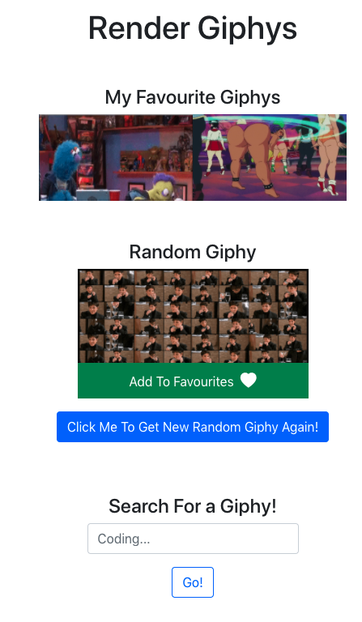
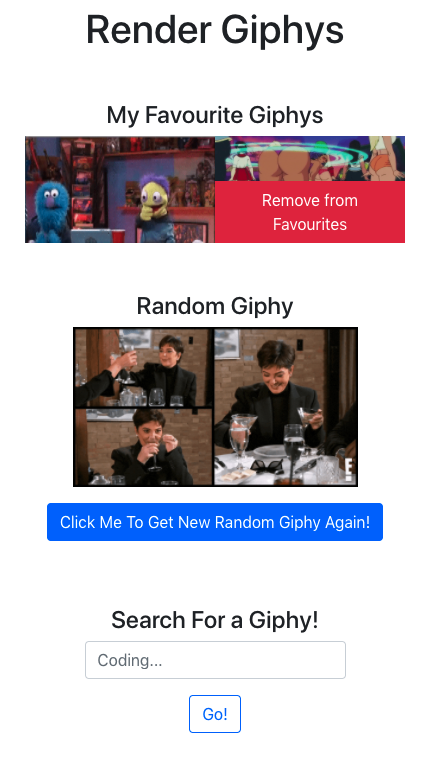
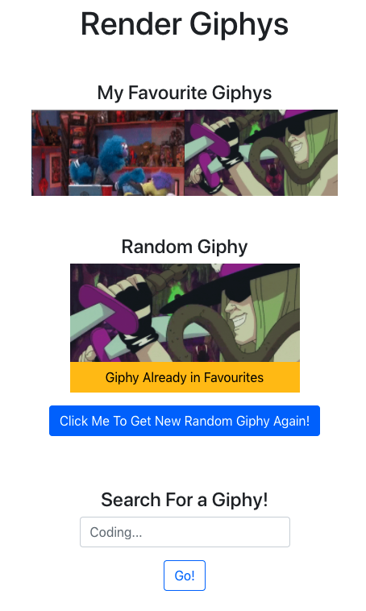

# Render Giphys Homework

This is an approach to w16d2 Render Giphys Homework. Do not take this as the model answer. There are always different approaches towards solving a problem.

Rather, look at this as an alternative approach and focus on:

- how different hooks are used
- how `props` are flowing from a parent component to a child component
- how a child component invokes a function prop to effect a change in the parent state

# What the end product looks like?

### Add a giphy to favourites



---

### Remove a giphy from favourites



---

### Prevent a giphy from being added to favourites



# Running this `react` app

- Create a `env` file `.env.development.local` in the root folder and add the following to the `env` file:

```bash
REACT_APP_API=https://api.giphy.com/v1/gifs
REACT_APP_API_KEY=yourgiphyapikey
```
- Replace "yourgiphyapikey" with your own API key
- `npm install`
- `npm start`
