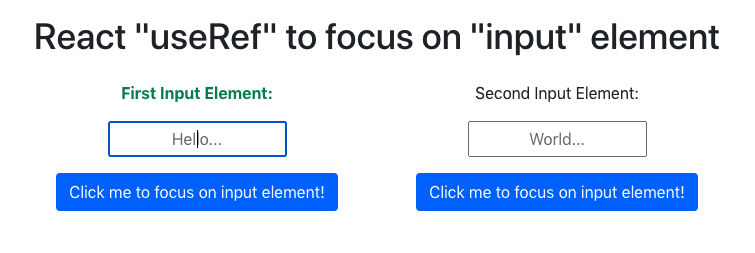

# React `useRef` to focus on `<input>` element

Besides using `useRef` to extract the value of an uncontrolled `<input>` element, `useRef` can also be used to focus on an `<input>` element.

# Example

In this example, on clicking each button, the corresponding input element will be in focus and the corresponing label will turn green.



The code would look something like the following:

```js
firstInputRef.current.focus()
```

The reference `useRef` points to can be any element in your react application. As long as it serves your intended case, feel free to implement it!