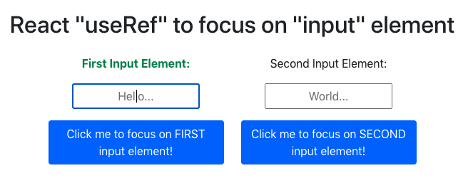

# React `useRef` to focus on `<input>` element

Besides using `useRef` to extract the value of an uncontrolled `<input>` element, `useRef` can also be used to focus on an `<input>` element.

# When to Use Refs

According to `react`, there are a few good use cases for refs:

- Managing focus, text selection, or media playback.
- Triggering imperative animations.
- Integrating with third-party DOM libraries.

# Example

In this example, on clicking each button, the corresponding input element will be in focus and the corresponing label will turn green.



The code would look something like the following:

```js
firstInputRef.current.focus()
```

# Don't Overuse Refs

The reference `useRef` points to can be any element in your react application. As long as it serves your intended case, feel free to implement it! BUT, DON'T OVERUSE REFS!

According to `react`,

> Your first inclination may be to use refs to “make things happen” in your app. If this is the case, take a moment and think more critically about where state should be owned in the component hierarchy. Often, it becomes clear that the proper place to “own” that state is at a higher level in the hierarchy.

Read more about `useRef` [here](https://reactjs.org/docs/refs-and-the-dom.html).